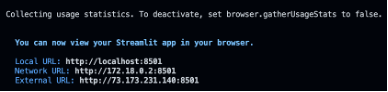

# Supercharge Your Streamlit Visualizations: Batch Processing Iceberg Data with Apache Flink
The exciting part is that after running all your Flink applications, the data now flows seamlessly into your Kafka Topics and Apache Iceberg Tables. But data alone doesn’t tell the story—it’s time to share those insights with the world! One fantastic way to do that is with Streamlit, which allows you to easily create interactive visualizations. Streamlit is intuitive, powerful, and designed with Python developers in mind, making it a breeze to turn raw data into captivating dashboards. 😉


**Table of Contents**

<!-- toc -->
+ [1.0 Prerequisite](#10-prerequisite)
+ [2.0 Power up the Apache Flink Docker containers](#20-power-up-the-apache-flink-docker-containers)
+ [3.0  Unleash the Full Power of Flink to Bring Your Data Visualizations to Life!](#30-supercharge-your-streamlit-visualizations)
    - [3.1 Special Mention](#31-special-mention)
+ [4.0 Resources](#40-resources)
<!-- tocstop -->


## 1.0 Prerequisite
Start by running the Java-based Flink application [`DataGeneratorApp`](https://github.com/j3-signalroom/apache_flink-kickstarter/blob/main/java/README.md) to kickstart the data pipeline. This app powers up your Kafka topics—`airline.skyone` and `airline.sunset`—by generating sample records that fuel the rest of the process. Once the data flows into Kafka, launch the [`FlightImporterApp`](https://github.com/j3-signalroom/apache_flink-kickstarter/blob/main/python/README.md) Flink application. This crucial step reads the enriched data from Kafka and writes it into the `apache_kickstarter.airlines.flight` Apache Iceberg table, seamlessly preparing your data for advanced analytics and insight generation. Get ready to see the magic of Flink in action!

## 2.0 Power up the Apache Flink Docker containers

> **Prerequisite**
> 
> Before you can run `scripts/run-flink-locally.sh` Bash script, you need to install the [`aws2-wrap`](https://pypi.org/project/aws2-wrap/#description) utility.  If you have a Mac machine, run this command from your Terminal:
> ````bash
> brew install aws2-wrap
> ````
>
> If you do not, make sure you have Python3.x installed on your machine, and run this command from your Terminal:
> ```bash
> pip install aws2-wrap
> ```

This section guides you through the local setup (on one machine but in separate containers) of the Apache Flink cluster in Session mode using Docker containers with support for Apache Iceberg.  Run the `bash` script below to start the Apache Flink cluster in Session Mode on your machine:

```bash
scripts/run-flink-locally.sh on --profile=<AWS_SSO_PROFILE_NAME>
                                --chip=<amd64 | arm64>
                                --aws-s3-bucket=<AWS_S3_BUCKET_NAME>
```
> Argument placeholder|Replace with
> -|-
> `<ACTIVATE_DOCKER_CONTAINER>`|`on` to turn on Flink locally, otherwise `off` to turn Flink off.
> `<AWS_SSO_PROFILE_NAME>`|your AWS SSO profile name for your AWS infrastructue that host your AWS Secrets Manager.
> `<CHIP>`|if you are running on a Mac with M1, M2, or M3 chip, use `arm64`.  Otherwise, use `amd64`.
> `<AWS_S3_BUCKET_NAME>`|can specify the name of the AWS S3 bucket used to store Apache Iceberg files.

To learn more about this script, click [here](.blog/run-flink-locally-script-explanation.md).

## 3.0 Supercharge Your Streamlit Visualizations
To illustrate, I created a Streamlit script that queries the `apache_kickstarter.airlines.flight` Apache Iceberg Table, harnessing Flink SQL to extract valuable insights. These insights are then brought to life through a Streamlit dashboard, transforming raw data into an accessible, visual experience.

Here you go, run this in the docker container terminal command line:

```bash
uv run streamlit run supercharge_streamlit/streamlit_with_local_flink.py -- --aws-s3-bucket <AWS_S3_BUCKET> --aws-region <AWS_REGION_NAME>
```
> _Notice the extra `--` between streamlit run `supercharge_streamlit/streamlit_with_local_flink.py` and the actual script arguments.  This is necessary to pass arguments to the Streamlit script without causing conflicts with Streamlit's own CLI options._

When you run the script, for instance, it produces the following output:



Open your host web browser, enter the local URL, `localhost:8501`, and in a few moments this web page will be displayed:


> _**"After many years in this industry, I’m still amazed by what we can achieve today!  The possibilities are endless—enjoy the ride!"**_
> 
> _**---J3**_

### 3.1 Special Mention
Before we move on, take a moment to notice something new right before the `flink run` command—the `uv` run comes right before it! What is `uv`, you ask? Well, it's an incredibly fast Python package installer and dependency resolver, written in Rust, and designed to seamlessly replace `pip` and pip-tools in your workflows. By prefixing uv run to a command, you're ensuring that the command runs in an optimal Python environment.

Now, let's break down the magic behind uv run:
- When you use it with a file ending in `.py` or an HTTP(S) URL, uv treats it as a script and runs it with a Python interpreter. In other words, `uv run` `file.py` is equivalent to `uv` run python file.py. If you're working with a URL, `uv` even downloads it temporarily to execute it. Any inline dependency metadata is installed into an isolated, temporary environment—meaning zero leftover mess! When used with `-`, the input will be read from `stdin`, and treated as a Python script.
- If used in a project directory, uv will automatically create or update the project environment before running the command.
- Outside of a project, if there's a virtual environment present in your current directory (or any parent directory), uv runs the command in that environment. If no environment is found, it uses the interpreter's environment.

So what does this mean when we put `uv` run before `flink run`? It means uv takes care of all the setup—fast and seamless—right on the Flink cluster. If you think AI/ML is magic, the work the folks at Astral have done with uv is pure wizardry!

Curious to learn more about Astral's `uv`? Check these out:
- Documentation: Learn about [uv](https://docs.astral.sh/uv/).
- Video: [uv IS the Future of Python Packing!](https://www.youtube.com/watch?v=8UuW8o4bHbw).

## 4.0 Resources

[Flink Python Docs](https://nightlies.apache.org/flink/flink-docs-master/api/python/)

[PyFlink API Reference](https://nightlies.apache.org/flink/flink-docs-release-1.20/api/python/reference/index.html)

[Apache Flink® Table API on Confluent Cloud - Examples](https://github.com/confluentinc/flink-table-api-python-examples)

[How to create a User-Defined Table Function (UDTF) in PyFlink to fetch data from an external source for your Flink App?](.blog/how-create-a-pyflink-udtf.md)

[Apache Iceberg in Action with Apache Flink using Python](.blog/apache-iceberg-in-action-with-apache-flink-using-python.md)