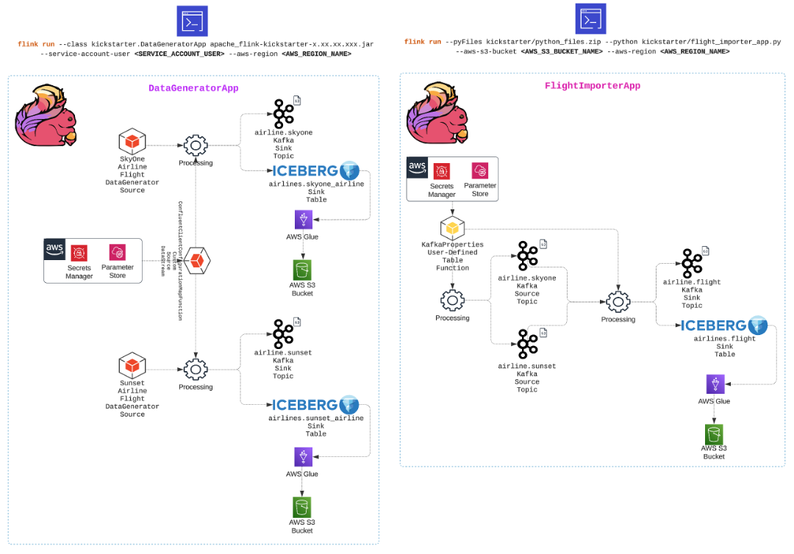

# Supercharge Your Streamlit Visualizations: Batch Processing Iceberg Data with Apache Flink
After you have all your fun running the Java-based Flink application [`DataGeneratorApp`](https://github.com/j3-signalroom/apache_flink-kickstarter/blob/main/java/README.md) to kickstart the data pipeline. This app powers up your Kafka topics—`airline.skyone` and `airline.sunset`—by generating sample records that fuel the rest of the process. Once the data flows into Kafka, launch the [`FlightImporterApp`](https://github.com/j3-signalroom/apache_flink-kickstarter/blob/main/python/README.md) Flink application. This crucial step reads the enriched data from Kafka and writes it into the `apache_kickstarter.airlines.flight` Apache Iceberg table, seamlessly preparing your data for advanced analytics and insight generation.



Get ready to see the magic of Flink in action! Now, it's time to share those insights with the world! One fantastic way to do that is with [`Streamlit`](https://streamlit.io/), which allows you to easily create interactive visualizations. Streamlit is intuitive, powerful, and designed with Python developers in mind, making it a breeze to turn raw data into captivating dashboards. 😉  


**Table of Contents**

<!-- toc -->
+ [1.0 Power up the Apache Flink Docker containers](#10-power-up-the-apache-flink-docker-containers)
+ [2.0 Supercharge Your Streamlit Visualizations](#20-supercharge-your-streamlit-visualizations)
    - [2.1 Special Mention](#21-special-mention)
+ [3.0 Local Integration: How This App Harnesses Apache Flink](#30-local-integration-how-this-app-harnesses-apache-flink)
+ [4.0 Resources](#40-resources)
<!-- tocstop -->

## 1.0 Power up the Apache Flink Docker containers

> **Prerequisite**
> 
> Before you can run `scripts/run-flink-locally.sh` Bash script, you need to install the [`aws2-wrap`](https://pypi.org/project/aws2-wrap/#description) utility.  If you have a Mac machine, run this command from your Terminal:
> ````bash
> brew install aws2-wrap
> ````
>
> If you do not, make sure you have Python3.x installed on your machine, and run this command from your Terminal:
> ```bash
> pip install aws2-wrap
> ```

This section guides you through the local setup (on one machine but in separate containers) of the Apache Flink cluster in Session mode using Docker containers with support for Apache Iceberg.  Run the `bash` script below to start the Apache Flink cluster in Session Mode on your machine:

```bash
scripts/run-flink-locally.sh on --profile=<AWS_SSO_PROFILE_NAME>
                                --chip=<amd64 | arm64>
                                --aws-s3-bucket=<AWS_S3_BUCKET_NAME>
```
> Argument placeholder|Replace with
> -|-
> `<ACTIVATE_DOCKER_CONTAINER>`|`on` to turn on Flink locally, otherwise `off` to turn Flink off.
> `<AWS_SSO_PROFILE_NAME>`|your AWS SSO profile name for your AWS infrastructue that host your AWS Secrets Manager.
> `<CHIP>`|if you are running on a Mac with M1, M2, or M3 chip, use `arm64`.  Otherwise, use `amd64`.
> `<AWS_S3_BUCKET_NAME>`|specify the name of the AWS S3 bucket used to store Apache Iceberg files.

To learn more about this script, click [here](.blog/run-flink-locally-script-explanation.md).

## 2.0 Supercharge Your Streamlit Visualizations
To access the Flink JobManager (`supercharge_streamlit-apache_flink-jobmanager-1`) container, open the interactive shell by running:

```bash
docker exec -it -w /opt/flink/python_apps supercharge_streamlit-apache_flink-jobmanager-1 /bin/bash
```

Jump right into the container and take charge! You’ll have full control to run commands, explore the file system, and tackle any tasks you need. You’ll land directly in the `/opt/flink/python_apps` directory—this is the headquarters for the Python script in the repo.

To illustrate, I created a Streamlit script that queries the `apache_kickstarter.airlines.flight` Apache Iceberg Table, harnessing Flink SQL to extract valuable insights. These insights are then brought to life through a Streamlit dashboard, transforming raw data into an accessible, visual experience.

Here you go, run this in the docker container terminal command line:

```bash
uv run streamlit run app.py -- --aws-s3-bucket <AWS_S3_BUCKET> --aws-region <AWS_REGION_NAME>
```
> _Notice the extra `--` between streamlit run `app.py` and the actual script arguments.  This is necessary to pass arguments to the Streamlit script without causing conflicts with Streamlit's own CLI options._

When you run the script, for instance, it produces the following output:


Open your host web browser, enter the local URL, `localhost:8501`, and in a few moments this web page will be displayed:


> _**"After many years in this industry, I’m still amazed by what we can achieve today!  The possibilities are endless—enjoy the ride!"**_
> 
> _**---J3**_

### 2.1 Special Mention
Before we move on, take a moment to notice something new right before the `flink run` command—the `uv` run comes right before it! What is `uv`, you ask? Well, it's an incredibly fast Python package installer and dependency resolver, written in [**Rust**](https://github.blog/developer-skills/programming-languages-and-frameworks/why-rust-is-the-most-admired-language-among-developers/), and designed to seamlessly replace `pip`, `pipx`, `poetry`, `pyenv`, `twine`, `virtualenv`, and more in your workflows. By prefixing `uv run` to a command, you're ensuring that the command runs in an optimal Python environment.

Now, let's break down the magic behind `uv` run:
- When you use it with a file ending in `.py` or an HTTP(S) URL, `uv` treats it as a script and runs it with a Python interpreter. In other words, `uv run file.py` is equivalent to `uv run python file.py`. If you're working with a URL, `uv` even downloads it temporarily to execute it. Any inline dependency metadata is installed into an isolated, temporary environment—meaning zero leftover mess! When used with `-`, the input will be read from `stdin`, and treated as a Python script.
- If used in a project directory, `uv` will automatically create or update the project environment before running the command.
- Outside of a project, if there's a virtual environment present in your current directory (or any parent directory), `uv` runs the command in that environment. If no environment is found, it uses the interpreter's environment.

So what does this mean when we put `uv` run before `flink run`? It means `uv` takes care of all the setup—fast and seamless—right on the Flink cluster. If you think AI/ML is magic, the work the folks at Astral have done with uv is pure wizardry!

Curious to learn more about Astral's `uv`? Check these out:
- Documentation: Learn about [`uv`](https://docs.astral.sh/uv/).
- Video: [`uv` IS THE FUTURE OF PYTHON PACKING!](https://www.youtube.com/watch?v=8UuW8o4bHbw).

## 3.0 Local Integration: How This App Harnesses Apache Flink
This [`app.py`](app.py) Python script streamlines Apache Flink integration by leveraging PyFlink directly in the [`app.py`](app.py) script. Running the Flink job using the same Python process as the [`Streamlit`](https://streamlit.io/) app offers an intuitive setup for local testing and debugging. It's an ideal solution for quickly iterating on data processing logic without additional infrastructure.

However, a more advanced setup is recommended for production environments where scalability is critical. Running Flink jobs in a separate process and enabling communication through Kafka or a REST API provides greater scalability, albeit at the cost of added complexity.

The simplicity of this app’s current approach makes it perfect for prototyping and development while offering a foundation to explore more sophisticated integration methods as your requirements grow.

## 4.0 Resources

[Flink Python Docs](https://nightlies.apache.org/flink/flink-docs-master/api/python/)

[PyFlink API Reference](https://nightlies.apache.org/flink/flink-docs-release-1.20/api/python/reference/index.html)

[Apache Iceberg in Action with Apache Flink using Python](https://github.com/j3-signalroom/apache_flink-kickstarter/blob/main/.blog/apache-iceberg-in-action-with-apache-flink-using-python.md)

[Streamlit Documentation](https://docs.streamlit.io/)